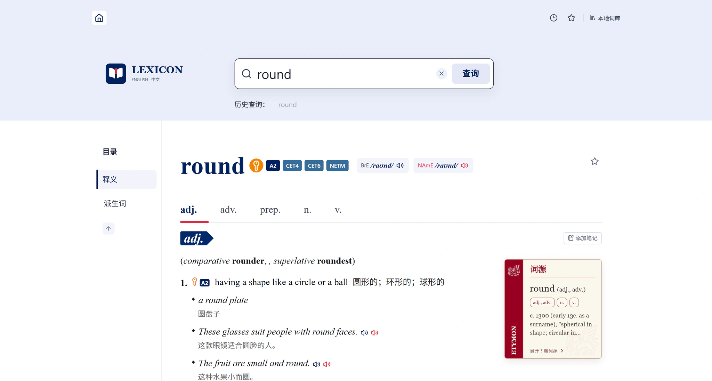
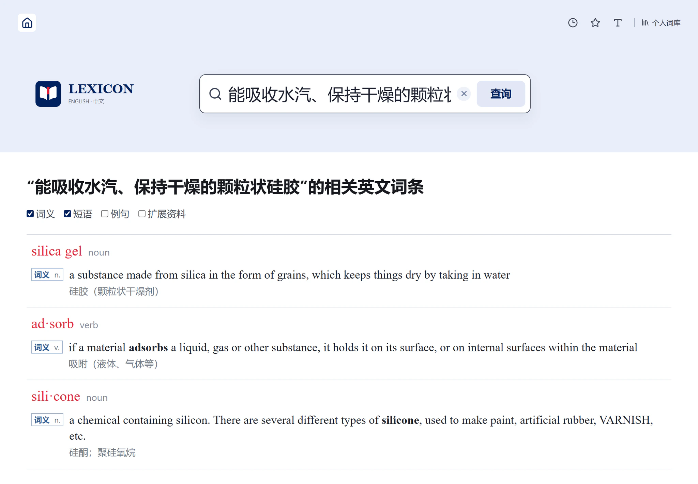
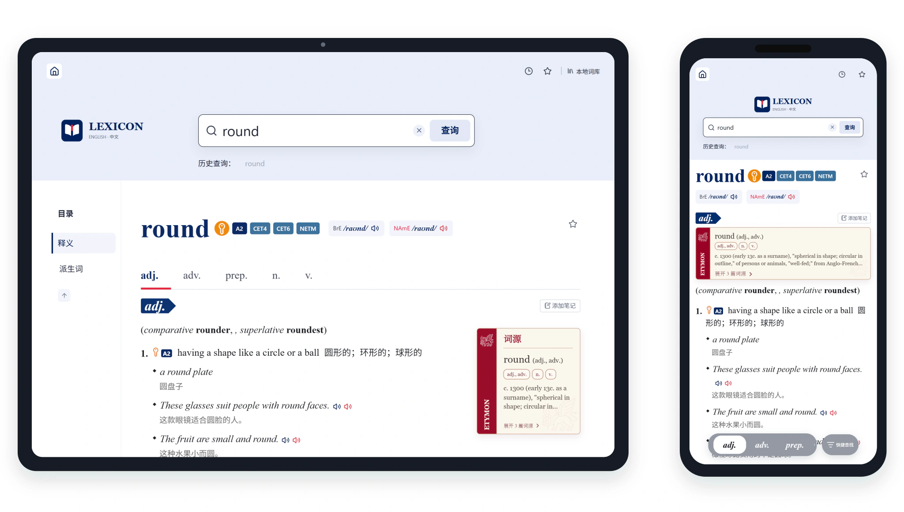
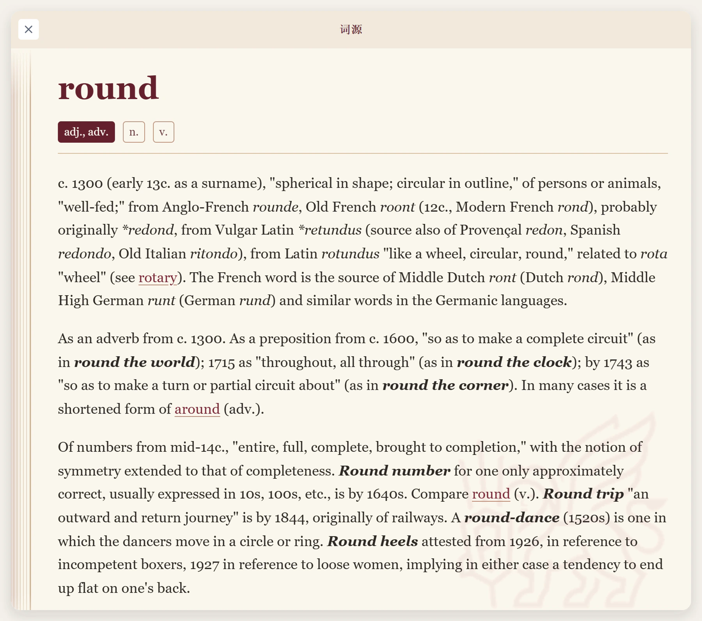
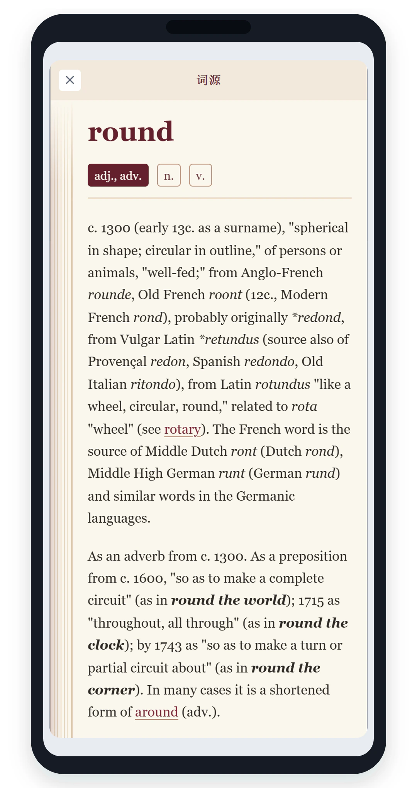

<div align="center">
  
  <h1>Lexicon</h1>
  <p><strong>Meaning, usage, and word history in one place.</strong><br><strong>把词义、用法与词语的来历放在一起。</strong></p>
  <p>A focused bilingual dictionary for looking up English, searching from Chinese, and reading a word as a complete entry.<br>一部专注于英文查询、中文反查与完整词条阅读的双语词典。</p>

  <p>
    <a href="https://github.com/ShallowDream724/lexicon/actions/workflows/ci.yml"></a>
    <a href="LICENSE"></a>
    <a href="https://nextjs.org/"></a>
    <a href="https://go.dev/"></a>
  </p>

  <p><strong>40,974 entries · 197,340 Chinese search records · 181,883 semantic vectors · 51,716 etymology articles · 128,010 headword pronunciations</strong><br><strong>40,974 个词条 · 197,340 条中文反查记录 · 181,883 个语义向量 · 51,716 篇词源文章 · 128,010 个词头发音</strong></p>
</div>



## Find the word you mean

**找到真正想查的那个词**

Search by spelling when you know the English word. When only a Chinese meaning comes to mind, Lexicon combines literal evidence with semantic intent to find likely English entries. A short description can reach a useful term even when it does not repeat the dictionary translation word for word. The matching definition, phrase, form, example, or reference card stays directly beneath each result, so the reason for a match remains visible.

知道英文时直接按拼写查询；只记得中文意思时，Lexicon 会结合字面证据与语义意图。即使输入没有照抄词典释义的简短描述，也能找到相关词条。命中的词义、短语、词形、例句或扩展资料会直接列在结果下方，匹配依据始终可见。

Selecting an evidence line opens the correct entry, switches to the right part of speech, and highlights the exact content after scrolling finishes. Broad searches begin with 32 results and can progressively reveal up to 512 without making the first request carry the full list.

选择某条命中依据后，会进入正确词条、切换到对应词性，并在滚动结束后高亮具体内容。范围较广的查询先展示 32 条，可逐步展开至 512 条，首个请求无需承担整份结果。



## Read the entry as a whole

**完整地读一个词条**

Definitions, constructions, examples, usage notes, idioms, phrasal verbs, derivatives, inflections, and cross-references keep their original hierarchy. Related material stays together instead of being flattened into disconnected search snippets.

释义、句型、例句、用法说明、习语、短语动词、派生词、词形变化与交叉引用保留原有层级，彼此相关的内容不会被拆成零散片段。

British and North American headword audio is streamed from the local archive. Sentence audio and illustrations use separate configurable connectors. Browsing history, search history, favorites, notes, and reading preferences stay in the current browser profile and require no account.

英式与北美词头发音从本地压缩包按需读取；例句音频与图解通过独立连接器配置。浏览记录、查询历史、收藏、笔记与阅读偏好保存在当前浏览器中，无需账号。

## One dictionary, shaped for each screen

**同一部词典，为每块屏幕重新排布**

Desktop keeps the outline and supplementary cards within reach. Portrait and landscape tablet layouts rebalance the reading column and resources. Phone layouts provide touch lookup, compact navigation, and a part-of-speech dock while retaining the complete entry. A three-level reading control adjusts article content without distorting summary cards.

桌面端把目录与补充卡片放在随手可达的位置；平板横竖屏会重新平衡正文与资源区；手机端加入点词查询、紧凑导航和词性停靠栏，同时保留完整词条。三档阅读字号只调整正文阅读区域，不会挤坏摘要卡片。

Lexicon is installable as a PWA. Installation stores a small application shell; dictionary entries and media continue to load from the server only when requested.

Lexicon 可以作为 PWA 安装。设备仅保存轻量应用外壳，词条与媒体仍在需要时从服务器按需加载。



## Word history, beside the meaning

**词义旁边，也有词语的来历**

When an entry has matching etymology, a compact preview sits naturally beside the dictionary content. Opening it reveals the full article, with separate records for different parts of speech and senses. Linked terms inside an article remain searchable.

词条匹配到词源时，会在正文旁自然地出现一张预览卡。展开后可以阅读全文，不同词性与义项各自保留，文内关联词也能继续查询。

Terms found only in the etymology collection remain searchable through a focused enhancement-only entry. This lets supplementary resources extend coverage while keeping the primary dictionary model clean.

仅存在于词源资料中的词语也可以直接搜索，并进入专用的扩展词条。补充资源可以扩大覆盖面，同时保持主词典模型清晰稳定。



<p align="center">
  
</p>

## A large library that stays light

**数据充足，日常请求依然轻量**

Indexed lookup, bounded candidate pools, and independently compressed entries let the server return only the selected content. Opening the site or installing the PWA does not download the full dictionary or the 1.06 GiB pronunciation archive.

索引查询、有界候选集与独立压缩词条让服务器只返回当前需要的内容。打开网站或安装 PWA 时，不会下载整部词典，也不会把 1.06 GiB 的发音包存进设备。

| Dataset<br>数据集 | Coverage<br>规模 | Runtime asset<br>运行资源 |
| --- | ---: | ---: |
| Core bilingual dictionary<br>双语主词典 | 40,974 entries<br>40,974 个词条 | 51.5 MiB |
| Chinese reverse search<br>中文反查 | 197,340 documents · 361,278 exact segments · 16,861 headword forms · 117,214 English lookup keys<br>197,340 条文档 · 361,278 个精确片段 · 16,861 个词形 · 117,214 个英文检索键 | 97.7 MiB |
| Semantic intent search<br>语义意图检索 | 181,883 vectors · 1,024 dimensions<br>181,883 个向量 · 1,024 维 | 247.9 MiB |
| Etymology enhancement<br>词源扩展 | 46,773 terms · 51,716 articles<br>46,773 个词语 · 51,716 篇文章 | 43.3 MiB |
| Headword pronunciation<br>词头发音 | 128,010 MP3 assets<br>128,010 个 MP3 | 1.06 GiB |

The local reverse-search sidecar answers representative multi-character queries in roughly 0.6–2.5 ms at p95 on the documented reference machine; an intentionally broad one-character query remains below 42 ms at p95. Semantic search is reserved for explicit multi-character submissions: recorded first calls took 0.66–1.42 seconds. A 40-request loopback sample of cached hybrid search measured 32.7 ms at p50 and 45.3 ms at p95. Reproducible storage, quality, and cost details live in [STORAGE_FORMAT.md](STORAGE_FORMAT.md) and [SEMANTIC_SEARCH.md](SEMANTIC_SEARCH.md).

在文档记录的参考环境中，本地中文反查侧库的典型多字查询 p95 约为 0.6–2.5 ms；刻意选择的宽泛单字查询 p95 仍低于 42 ms。语义检索只在用户明确提交多字中文时触发：实测首次调用上游约需 0.66–1.42 秒；缓存命中的 40 次完整 hybrid 请求，p50/p95 为 32.7/45.3 ms。可复现的存储、质量与成本细节见 [STORAGE_FORMAT.md](STORAGE_FORMAT.md) 和 [SEMANTIC_SEARCH.md](SEMANTIC_SEARCH.md)。

## Quick start

**快速开始**

The complete local application requires Node.js 22.13 or newer and Go 1.24 or newer.

完整本地应用需要 Node.js 22.13 或更高版本，以及 Go 1.24 或更高版本。

```bash
npm ci
npm run data:download
```

The download is about 1.49 GiB. It retrieves the versioned [runtime-data-v1 Release](https://github.com/ShallowDream724/lexicon/releases/tag/runtime-data-v1), verifies every file against `runtime-assets.json`, and creates the shared runtime layout of four databases and one packed audio archive:

完整下载量约为 1.49 GiB。命令会获取带版本的 [runtime-data-v1 Release](https://github.com/ShallowDream724/lexicon/releases/tag/runtime-data-v1)，依据 `runtime-assets.json` 校验每个文件，并创建由四个数据库和一个压缩音频包组成的运行目录：

```text
data/
  dictionary.db
  etymology.db
  reverse-search.db
  semantic-search.db
  headword-audio.zip
```

Keep `headword-audio.zip` packed. For manually transferred assets, place all five files at these paths and run `npm run data:verify`. The semantic sidecar is fingerprinted to both the primary dictionary and reverse-search sidecar, so all three databases must be updated together.

`headword-audio.zip` 无需解压。手动传输资源时，请把五个文件放到上述路径，并运行 `npm run data:verify`。语义侧库同时带有主词典与中文反查侧库的指纹，因此这三个数据库必须配套更新。

Start the API and web application in separate terminals:

在两个终端中分别启动 API 与 Web 应用：

```bash
npm run dev:api
```

```bash
npm run dev
```

Open `http://localhost:3000`. The web application calls `http://localhost:8787/api/v1` by default. `LEXICON_DATA_BASE_URL` selects another asset mirror, and `LEXICON_DATA_DIR` selects another local data directory.

打开 `http://localhost:3000`。Web 应用默认调用 `http://localhost:8787/api/v1`。可通过 `LEXICON_DATA_BASE_URL` 选择其他资源镜像，通过 `LEXICON_DATA_DIR` 选择其他本地数据目录。

Semantic intent search is optional at runtime. Configure an OpenAI-compatible embeddings endpoint and a model compatible with the released sidecar to enable it; without those settings, Chinese lookup keeps its complete local lexical path. Typing suggestions never call the provider. Explicit multi-character Chinese searches use a three-second provider timeout and fall back to local results without interrupting the page. Deployments can retain query vectors across restarts in a bounded cache that stores keyed hashes rather than query text. The released contract, one-command rebuild, provider options, quota guard, cache settings, and measured quality are documented in [SEMANTIC_SEARCH.md](SEMANTIC_SEARCH.md).

语义意图检索在运行时可选。配置与发布侧库兼容的 OpenAI 格式 Embeddings 接口和模型即可启用；未配置时，中文反查仍会完整使用本地字面检索。输入过程中的联想不会调用上游；明确提交多字中文后，provider 请求采用 3 秒超时，异常时页面会无感回到本地结果。部署端还可用有界缓存跨重启复用查询向量，磁盘只保存带密钥的摘要，不保存查询原文。发布契约、一键重建、接口选项、额度保护、缓存设置与实测质量见 [SEMANTIC_SEARCH.md](SEMANTIC_SEARCH.md)。

For self-hosted Docker deployment, configure the reference environment and start the bundled web, API, and reverse-proxy services. HTTPS, proxy, asset, update, and rollback notes are in [DEPLOYMENT.md](DEPLOYMENT.md).

自托管 Docker 部署需要配置参考环境，再启动项目内的 Web、API 与反向代理服务。HTTPS、代理、资源、更新与回滚说明见 [DEPLOYMENT.md](DEPLOYMENT.md)。

```bash
cp deploy/server/.env.example deploy/server/.env
docker compose --env-file deploy/server/.env -f deploy/server/compose.yaml up -d --build
```

## Built to accept new resources

**为后续扩展留出清楚边界**

The interface reads one canonical entry model. Import adapters, search projections, and enhancement resources remain independent of rendering. Content mapped to canonical senses, phrases, forms, examples, guidance, and cards enters the relevant search and presentation paths without spreading source-specific branches through the UI.

界面只读取统一的规范词条模型；导入适配器、中文搜索投影与增强资源独立于渲染层。映射到规范义项、例句、短语、用法、词形和卡片的数据，会进入对应的搜索与展示路径，无需把针对来源的分支散落到 UI 各处。

| Document<br>文档 | Scope<br>内容 |
| --- | --- |
| [ARCHITECTURE.md](ARCHITECTURE.md) · [DATA_MODEL.md](DATA_MODEL.md) | Module ownership and dictionary contracts<br>模块职责与词典契约 |
| [ADAPTER_GUIDE.md](ADAPTER_GUIDE.md) · [STORAGE_FORMAT.md](STORAGE_FORMAT.md) · [SEMANTIC_SEARCH.md](SEMANTIC_SEARCH.md) | Source adapters, lexical and semantic indexing, compression, and migration<br>数据源适配、字面与语义索引、压缩与迁移 |
| [QUALITY_EVALUATION.md](QUALITY_EVALUATION.md) | Test construction, retrieval evaluation, vector reuse, and corpus audits<br>测试构筑、检索评估、向量复用与全库审计 |
| [PWA.md](PWA.md) · [DEPLOYMENT.md](DEPLOYMENT.md) | Installation, cache boundaries, self-hosting, and updates<br>安装、缓存边界、自托管与更新 |
| [CONTRIBUTING.md](CONTRIBUTING.md) | Development workflow and release checks<br>开发流程与发布检查 |

The application source is available under the [MIT License](LICENSE); the released dictionary databases and pronunciation media are provided for study use only.

应用源代码采用 [MIT License](LICENSE) 发布；发布的词典数据库与发音媒体仅供学习使用。
